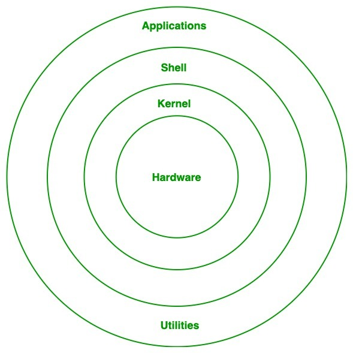

# What is Linux Operating System

The Linux Operating System is a type of operating system that is similar to Unix. And ir is built upon the Linux kernel. The Linux Kernel is like the brain of the operating system because it manages how the computer interacts with its hardware and resources. It makes sure everything works smoothly and efficiently. But the Linux Kernel alone is not enough to make a complete operating system. To create a full and functional system, the Linux Kernel is combined with a collection of software packages and utilities, which are together called Linux distributions. These distributions make the Linux Operating System ready for users to run their applications and perform tasks on their computers securely and effectively. Linux distributions come in different flavors, each tailored to suit the specific needs and preferences of users.

## Linux History
Linus Torvalds designed the free and open-source Linux operating system kernel in 1991. Torvalds set out to develop a free and flexible system for personal computers, drawing ideas from the UNIX operating system and the MINIX operating system.Teamwork in development was encouraged with the initial release of the Linux kernel, which attracted developers and enthusiasts globally quickly. Various open-source software packages integrated with the Linux kernel created fully operational operating systems, occasionally referred to as Linux distributions. Over the years, Linux has become known as a key component of modern computing, powering everything from servers and personal computers to supercomputers and smartphones. Due to its flexibility, durability, and strong community support, developers, businesses, and educational institutions frequently opt for it.

## What is Linux?
Linux is free and open-source family of operating systems that is resilient and flexible. In 1991, an individual by the name as Linus Torvalds constructed it. The system's source code is accessible to everyone for anyone to look at and change, making it cool that anyone can see how the system works. People fromm all across the world are urged to work together and keep developing Linux due to its openness. Since the beginning, Linux has grown into a dependable and safe OS that is used in an array of gadgets, Including PCs, cell phones, and huge supercomputers. It is well-known for being cost-effective, which implies that employing it doesn't cost a lot adn efficient, which indicates it can complete a lot of jobs quickly. A lot of people love Linux, and

## What is Linux Operating System?
Developed by Linus Torvalds in 1991, the Linux operating system is a powerful and flexible open-source software platform. It acts as the basis for a variety of devices, such as embedded systems, cell phones, servers, and personal computers. Linux, that's well-known for its reliability, safety, and flexibility, allows users to customize and improve their environment to suit specific needs. With an extensive and active community supporting it, Linux is an appealing choice for people as well as companies due to its wealth of resources and constant developments.

## What is a distribution ?

Linux distribution is an operating system that is made up of a collection of software based on Linux kernel or you can say distribution contains the Linux kernel and supporting libraries and software. And you can get Linux-based operating system by downloading one of the Linux distributions and these distributions are available for different types of devices like embedded devices, personal computers, etc. Around 600 + Linux Distributions are available and some of the popular Linux distributions are:

## Why use Linux?
Because it is free, open-source, and extremely flexible, Linux is widely utilized. For servers and developers, it is the ideal option because it offers strong security, stability, and performance. Generally interoperable hardware, a broad software library, and a vibrant community that offers support an regular updates are the many benefits of Linux. Due to its adaptability, users can customize the operating system according to their own needs, whether they become for personal or large enterprise use.

## Architecture of Linux
Linux architecture has the following components:

1. Kernel: Kernel is the core of the Linux based operating system. It virtualize the common hardware resources of the computer to provide each process with its virtual resources. This make the process seem as if it is the sole process running on the machine. The kernel is also responsible for preventing and mitigating conflicts between different processes. 
2. System Library: Linux uses system libraries, also known as shared libraries, to implement various functionalities of the operating system. These libraries contain pre-written code that applications can use to perform specific tasks. By using these libraries, developers can save time and effort, as they don't need to write the same code repeatedly. System libraries act as an interface between applications and the kernel, providing a standardized and efficient way for applications to interact with the underlying system.
3. Shell: The shell is the user interface of the Linux Operating System. It allows users to interact with the system by entering commands, which the shell interprets and executes. The shell serves as a bridge between the user and the kernel, forwarding the user's requests to the kernel for processing. It provides a convenient way for users to perform various tasks, such as running programs, managing files, and configuring the system.
4. Hardware Layer: The hardware layer encompasses all the physical components of the computer, such as RAM,HDD,CPU and input/output devices. This layer is responsible for interacting with the Linux Operating System and providing the necessary resources for the system and applications to function properly. The Linux kernel and system libraries enable communication and control over these hardware components, ensuring that they work harmoniously together.
5. System Utility: System utilities are essential tools and programs provided by the Linux Operating System to manage and configure various aspects of the system. These utilities perform tasks such as installing software, configuring network settings, monitoring system performance, managing users and permissions. and much more. System utilities simplify system administration tasks, making it easier for user to maintain their Linux systems efficiently.

# Conclusion
In this article, we discussed Linux Operating System which is a powerful and flexible open-source operating system based on the Linux Kernel. With a collaborative global community, it offers security, frequent updates, and diverse distributions tailored to user needs. Its architecture, comprising the kernel, system libraries, shell, hardware layer, and utilities, ensures efficient functionality. While Linux boast high performance, stability and compatibility, challenges include user-friendliness for beginners and a limited number of peripheral hardware drivers. Despite this, Linux remains a significant player in computing, poised for continued evolution and relevance.
