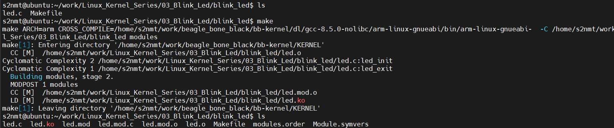
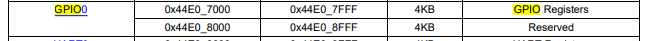
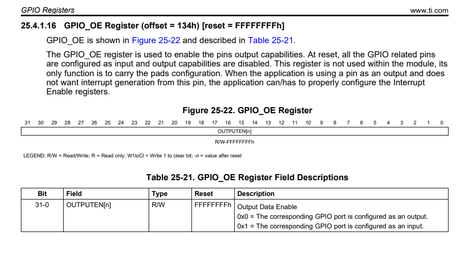
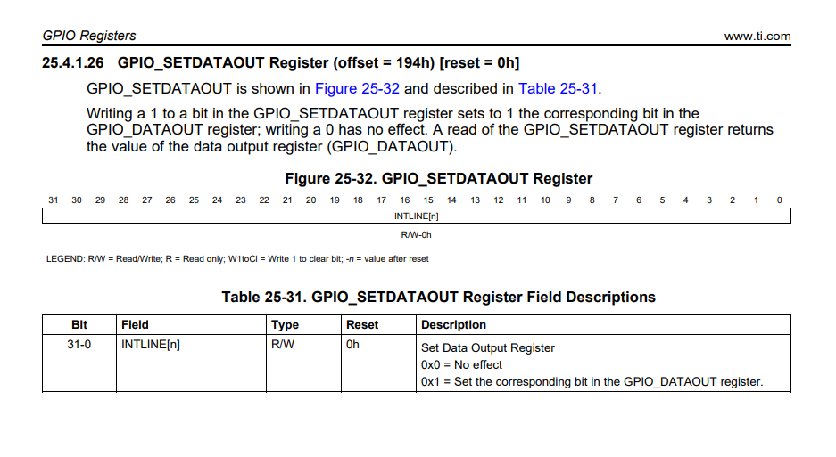

# Introduction
This folder contains code to implement an LED blink driver on the BeagleBone Black.

To cross-compile the led.c file and build it into the led.ko kernel module, follow these steps:
- 1 Cross-compile the led.c file on your host machine to generate led.ko (make command in blink_led folder).
  
    

- 2 Copy led.ko to an SD card using the following command:

    lsblk # check sdcard

    sudo mount /dev/sdb1 /media/rootfs/
  
    sudo cp led.ko /media/rootfs/home/debian/
  
    sync
  
    sudo umount /media/rootfs
- 3 Insert the SD card into the BeagleBone Black, power it on and load the kerbel module with:

    sudo /sbin/insmod led.ko # Led will turn on

- 4 Remove it

    sudo /sbin/rmmod led.ko # led will turn off

## Export variable to PATH

**Step1: Open file .bashrc to modify**

- nano ~/.bashrc

**Step2: add line into last file**

- export PATH=$PATH:/sbin

**Step3: save and exit**

## Apply changes immediately by re-sourcing the file
- source ~/.bashrc

## Explain code

    #define GPIO_0_ADDR_BASE        0x44E07000
    #define GPIO_0_ADDR_SIZE        (0x44E07FFF - 0x44E07000)

    #define GPIO_OE_OFFSET                  0x134
    #define GPIO_CLEARDATAOUT_OFFSET        0x190
    #define GPIO_SETDATAOUT_OFFSET          0x194

    static int __init led_init(void)
    {
        base_addr = ioremap(GPIO_0_ADDR_BASE,GPIO_0_ADDR_SIZE); // map address physical
        if(!base_addr){
            return -ENOMEM;
        }
        *(base_addr + GPIO_OE_OFFSET/4) &= ~LED; // enable led output
        *(base_addr + GPIO_SETDATAOUT_OFFSET/4) |= LED; // turn on led

        pr_info("Hello! Initizliaze successfully!\n");

        return 0;
    }

    static void __exit led_exit(void)
    {
        *(base_addr + GPIO_CLEARDATAOUT_OFFSET / 4) |= LED; // turn off led
        iounmap(base_addr);
        pr_info("Good bye my friend");
    }

    module_init(led_init); /
    module_exit(led_exit);

- module_init(led_init) is used to define the function that gets called when the module is loaded.

- module_exit(led_exit) is used to define the function that gets called when the module is unloaded.
