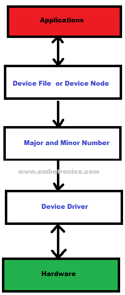

# Character Device
## Introduction
A character device is a type of device file that allows user-space programs to interact with hardware or virtual devices through a character-oriented interface. Character devices are typically accessed through special files in the /dev directory and are handled by character device drivers.

## How Applications will communicate with Hardware devices?

  

- Initially, the Application will open the device file. This device file is created by the device driver.
- Then this device file will find the corresponding device driver using major and minor numbers.
- Then that Device driver will talk to the Hardware device

## Character Device Driver Major Number and Minor Number

One of the basic features of the Linux kernel is that it abstracts the handing of devices. All hardware devices look like regular files. They can be opened, closed, read and written using the same, standard, system calls that are used to manipulate files. To linux, everything is a file. To write to the hard disk, you write to a file. To read from the keyboard is to read from a file. To store backups on a tape device is to write to a file. Even to read from memory is to read from a file. If the file from which you are trying to read or to which you are trying to write is a "normal" file, the process is fairly easy to understand. The file is opened and you read or write data. So the device driver also likes the file. The driver will create a special file for every hardware device. We can communicate with the hardware using those special files.

If you want to create a special file, we should know about the major number and minor number in the device driver. In this tutorial, we will learn the major and minor numbers.

## Major number and Minor number

The Linux kernel represents character and block devices as pairs of number < major > : < minor >

## Major number 
Traditionally, the major number identifies the driver associated with the device. A major number can also be shared by multiple device drives. See /proc/devices to find out how major numbers are assigned on a running Linux instance