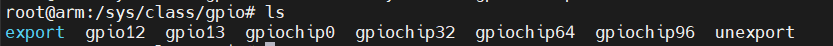
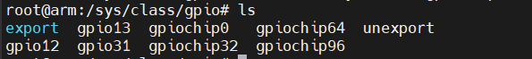
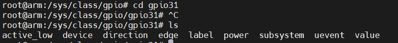
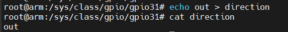
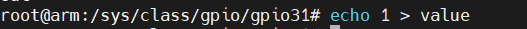
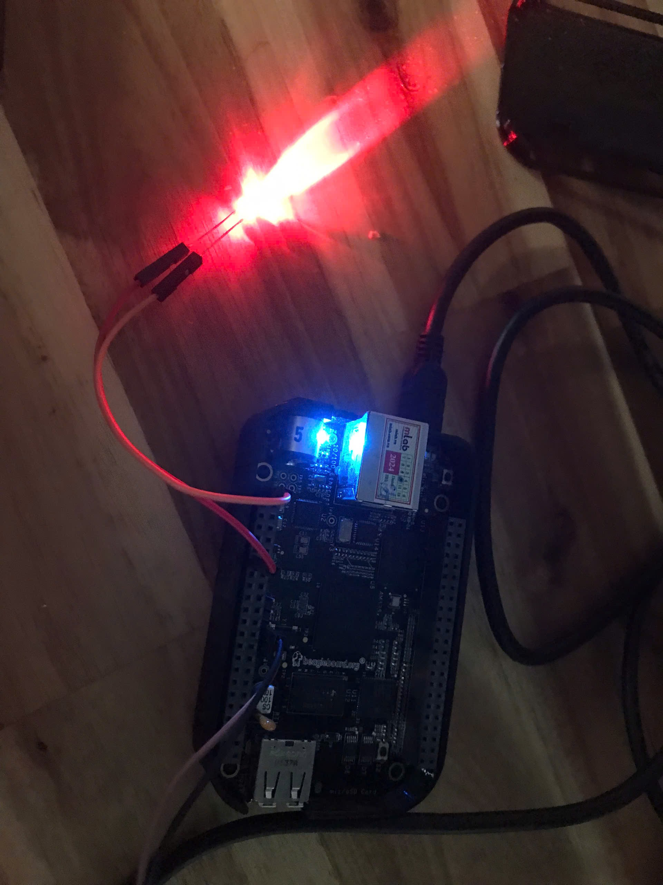
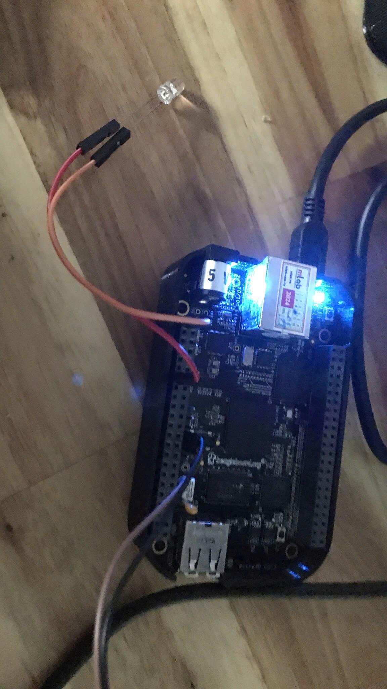

# Pin control subsystem
command: to access root.

    su 

command: move the this folder.

    cd /sys/class/gpio/ 

    ls

command: export GPIO31 Pin

    echo 31 > /sys/class/gpio/export  

    cd gpio31 + ls

    cat direction

    echo out > direction

    echo 1 turn on LED

    echo 0 turn off LED 

    cd .. 
    echo 31 > /sys/class/gpio/unexport
    ls
    
