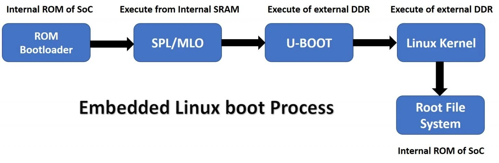

# Boot process

## Bootloader 
This is code that runs first time when we apply power to the embedded device. Bootloader will initialization hardwares before loading the operating system. When a processor boot ups or resets, each processor has a number of predefined hardware steps and configurations.

The following are the main roles of a bootloader:
- Target hardware initialization
- Load the application binary (operating system, root file system, device tree) from the non-volatile external storage to the RAM memory
- RAM connects externally to the SOC and it stores run-time data, operating system, root file system, application software, and stack/heap.
- After that execute the main operating system code from the RAM memory.
  
Different microprocessors may have a distinct process of the booting sequence but the underlying concepts remain the same.

## Embedded Linux Boot flow process for beaglebone black

Phase 1:
The fist component is a first stage bootloader or a ROM bootloader. This is usually stored inside the flash memory of SoC by the manufacturer and we cannot change it.

Phase 2:
The main role of RBL is to load the second stage bootloader that is SPL (secondary program loader) or MLO (memory loader) from the internal SRAM of SoC.

Phase 3:
The job of MLO is to load and execute a third stage bootloader such as U-boot from the DDR memory of the development board but DDR is off the SoC

Phase 4:
The third stage bootloader which is U-boot loads the Linux kernel memory from persistent storage such as an SD card to DDR memory of the development board.

Phase 5:
After that system starts to execute its first proces initi and mounts the root file system.
